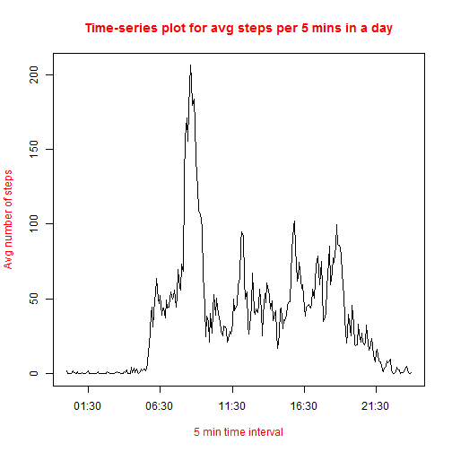
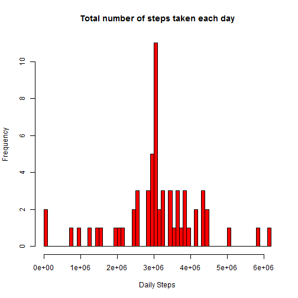

Reporducable Research Peer Assignment
========================================================


## Loading and Transforming the data for our analysis

First download the the source data file and then load it using the read.csv

```r
fileurl <- "https://d396qusza40orc.cloudfront.net/repdata%2Fdata%2Factivity.zip"
download.file(fileurl, dest = "activity.zip", method = "curl")
Data <- read.csv(unz("activity.zip", "activity.csv"))
```


Now in the next step we'll preprocess the data for our analysis as follow:

Combine the date and time to form a timestamp

```r
Data$activityTS <- paste(Data$date,sprintf("%04i",as.numeric(Data$interval)))
Data$activityTS <- as.POSIXlt(Data$activityTS,format="%Y-%m-%d %H%M")
```

Transform the data as per our requirements, which we can use for our analysis:

```r
## Extract the month
Data$month <- unclass(Data$activityTS)$mon
## Extract the hour
Data$hour <- unclass(Data$activityTS)$hour
## Extract the day of the Year
Data$yday <- unclass(Data$activityTS)$yday
```

Now to plot the frequency Histogram for total steps taken per day, we can summarize
the total number of steps for each day as follow:

```r
## Sum the total steps for each corresponding day
stepsPerDay <- tapply(Data$steps , Data$yday , FUN = sum , na.rm=TRUE)
DailySteps <- data.frame(Steps = stepsPerDay, Day = names(stepsPerDay))
DailySteps$Steps <- as.numeric(DailySteps$Steps)
DailySteps$Day <- as.numeric(DailySteps$Day)
```


## Mean total number of steps taken per day
Now we have the total number of steps/day in DailySteps dataframe. We can use it to 
draw the histogram as:

```r
hist(DailySteps$Steps,
     breaks=length(DailySteps$Steps), 
     main="total number of steps taken each day",
     xlab="Daily Steps",
     col="red")
```

 

Also to calculate and report the mean and median total number of steps taken per day:

```r
summary(DailySteps$Steps)
```

```
##    Min. 1st Qu.  Median    Mean 3rd Qu.    Max. 
##       0    6780   10400    9350   12800   21200
```


## Average daily activity pattern

Summarize the data for each five minute intervals acrros all days:

```r
StepsPerInterval <- tapply(Data$steps, sprintf("%04i",as.numeric(Data$interval)), FUN=mean, na.rm=TRUE)
StepsPer5MinInterval <- data.frame(Steps=StepsPerInterval,minutes=names(StepsPerInterval))
StepsPer5MinInterval$Steps <- as.numeric(StepsPer5MinInterval$Steps)
StepsPer5MinInterval$Interval <- strptime(StepsPer5MinInterval$minutes, format='%H%M')
```

Make a time series plot (i.e. type = "l") of the 5-minute interval (x-axis) and the average 
number of steps taken, averaged across all days (y-axis)

```r
plot(StepsPer5MinInterval$Interval, StepsPer5MinInterval$Steps, 
     type='l',xlab="", ylab="")

title(main="Time-series plot for avg steps per 5 mins in a day", col.main="red", 
      xlab="5 min time interval", ylab="Avg number of steps",
      col.lab="red")
```

 

To calculate 5-minute interval, on average across all the days in the dataset, 
contains the maximum number of steps:

```r
maxStepsInterval <- as.vector(StepsPer5MinInterval[StepsPer5MinInterval$Steps == max(StepsPer5MinInterval$Steps),]$minutes)
maxStepsInterval
```

```
## [1] "0835"
```

So we can see that above interval have the maximum number of steps averaged across all the days.


## Imputing missing values

To calculate number of missing values in the dataset (i.e. the total number of rows with NAs),
we can look for the NA values for steps in our main dataset as follow:


```r
## Total missing values:
length(Data[is.na(Data$steps),]$steps)
```

```
## [1] 2304
```

Now for records having missing steps recording for all of the 5 minutes time intervals, as above, 
we can use the mean for that 5-minute interval for all the given days data.


```r
## Merge the StepsPer5MinInterval$interval <- as.numeric(as.vector(StepsPer5MinInterval$minutes))
Data1 <- merge(Data, StepsPer5MinInterval, x.by="interval",y.by="interval",all=FALSE)
Data1[is.na(Data1$steps),]$steps <- as.integer(Data1[is.na(Data1$steps),]$Steps)
```

Now when we have the all the values for missing steps information, by using the above strategy,
we can create a new dataset having steps information for all the records.


```r
NewData <- data.frame(steps=Data1$steps, date=Data1$date, interval=Data1$interval)
```

Now we can use this new dataset for our analysis:


```r
NewData$activityTS <- Data$activityTS
NewData$yday <- Data$yday

stepsPerDayN <- tapply(NewData$steps , NewData$yday , FUN = sum)
DailyStepsN <- data.frame(Steps = stepsPerDayN, Day = names(stepsPerDayN))
DailyStepsN$Steps <- as.numeric(DailyStepsN$Steps)
DailyStepsN$Day <- as.numeric(DailyStepsN$Day)
```

Below is the frequency histogram for total number of steps/day

```r
hist(DailyStepsN$Steps,
     breaks=length(DailyStepsN$Steps), 
     main="Total number of steps taken each day",
     xlab="Daily Steps",
     col="red")
```

 

Also follwing is the summary for the new data having all the missing steps information:


```r
summary(DailyStepsN$Steps)
```

```
##    Min. 1st Qu.  Median    Mean 3rd Qu.    Max. 
##   11800 2830000 3060000 3100000 3690000 6100000
```

So we can see that for old data with missing values its mean is ```{r echo=FALSE} summary(DailySteps$Steps)[4] ``` and for new data with all the predicted values for steps its mean is ```{r echo=FALSE} summary(DailyStepsN$Steps)[4]```.

So we can coclude that with all the missing values its mean steps taken increases, as it was expected, and so does its median descreases, as a lot of the predicted missing values are less than its mean and so it shits to the left side as in the histogram.


##Are there differences in activity patterns between weekdays and weekends?

For this first we'll create a new factor variable in our new Dataset for representing if a day is weekday or weekend.

```r
NewData$dayType <- as.factor(ifelse(weekdays( NewData$activityTS) %in% c("Saturday","Sunday"), 
                                    "Weekend", "Weekday"))
```

Now we'll calculate the average number of steps taken for every five minutes interval, separately for both weekdays and weekends as:

```r
weekdayList <- NewData$dayType == "Weekday"
weekendList <- NewData$dayType == "Weekend"
StepsPerIntervalWeekday <- tapply(NewData[weekdayList,]$steps, 
                                  sprintf("%04i",(as.numeric(NewData[weekdayList,]$interval))),
                                  FUN=mean, na.rm=TRUE)

StepsPerIntervalWeekend <- tapply(NewData[weekendList,]$steps, 
                                  sprintf("%04i",(as.numeric(NewData[weekendList,]$interval))),
                                  FUN=mean, na.rm=TRUE)
```


Now plot the data for weekend and weekday steps activites averaged over all the days.

```r
par(mfrow=c(2,1))
plot(as.numeric(names(StepsPerIntervalWeekday)), StepsPerIntervalWeekday, 
     type='l',main="Weekday", col.main="red", 
     xlab="5 min time interval", ylab="Avg number of steps",
     col.lab="red")

plot(as.numeric(names(StepsPerIntervalWeekend)), StepsPerIntervalWeekend, 
     type='l',main="Weekend", col.main="red", 
     xlab="5 min time interval", ylab="Avg number of steps",
     col.lab="red")
```

 


